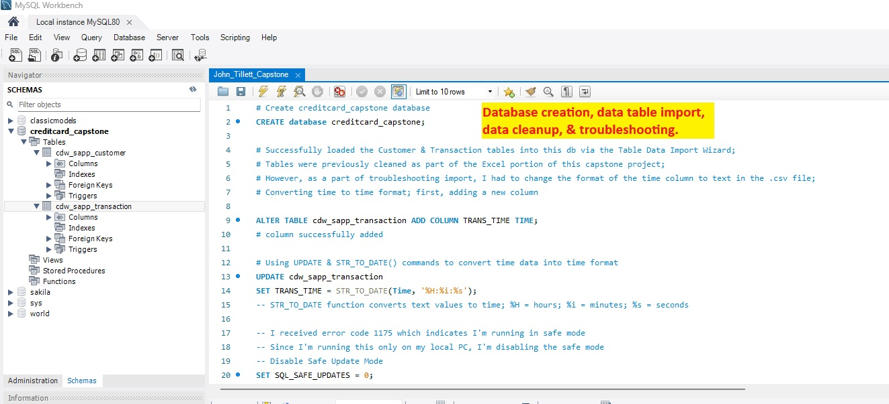
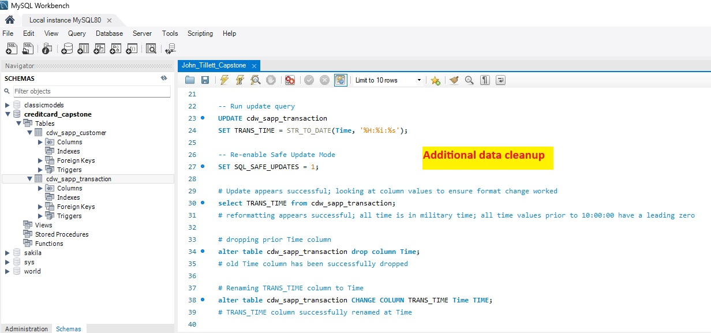
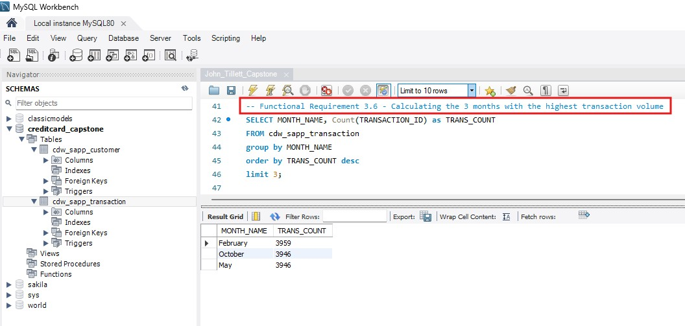
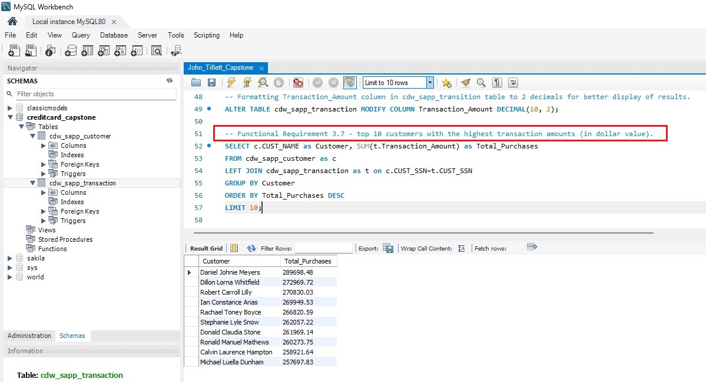
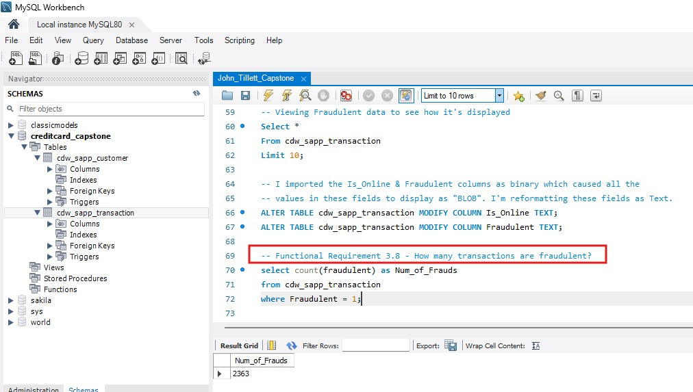
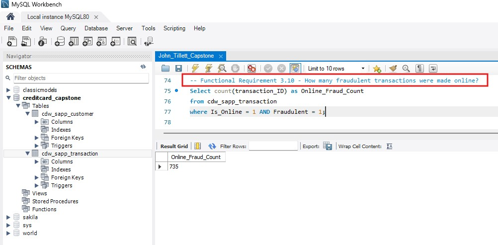
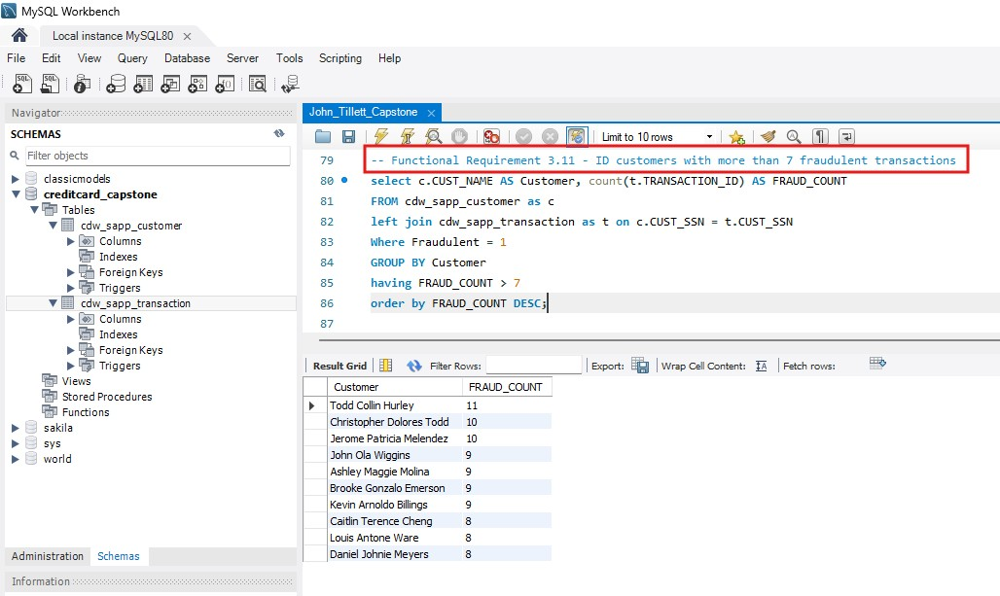

# Fraud Detection & Loan Insights Using MySQL Workbench

## Project Overview
Analysis of customer demographics, transactional behavior, loan applications, and fraud indicators in order to assist senior leadership in uncovering actionable insights to drive strategic decision-making. 

## Dashboard Preview

## Key Insights
- **Insight 1: There have been 2,363 fraudulent transactions; of which 735 were perpetrated online.
- **Insight 2: 10 customers have perpetrated 8 or more fraudulent transactions.
- **Insight 3: The 3 busiest months, in terms of transaction volume, are February, October, and May.

## How to View
1. Download the `Fraud_&_Loan_Analyses.sql` file located in the MySQL_File sub-repository.
2. Open with [MySQL Workbench 8.0.46](https://dev.mysql.com/downloads/workbench/).